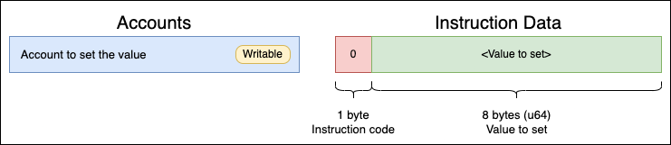
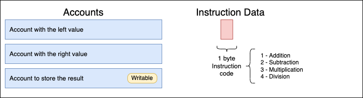

# Arithmetic

**Arithmetic** is my first Solana program. It's made with the aim of learning more about Solana, Blockchain, and Web3.

The behavior is simple, the program is capable to do the basic arithmetic operations (**Addition**, **Subtraction**, **Multiplication**, **Division**) between its accounts data. Each account has an u64 number stored in its data. To store a specific value in an account data, the program has the instruction **Set** to do it.

## Program Public Key and Network

The program executable account is `4sjupEYP4sXW34kxUP3NcrvQsdVqdcR6puHbcsZxBnET`. Program is available in the [testnet network](https://api.testnet.solana.com).

## Program accounts

To play with the program I created three accounts, here's the list:

- `GPWbEpGnTLKm78yvAyr6WKxdrv8zivXwehhJ5PL5KYG4`
- `H1DvteXAP4UGFNo4fxFkd5mACvqjxK1WyhgggRiXSh4E`
- `2zZEAUudWRjcyKdr8Z5BF311GDvxZkuYF97q8AA8SYFK`

## Instructions

All the instructions verify that the length of the data_instruction is exactly the necessary one, if it does not match the transaction will end with an error.

This is the list of all available instructions:

- `Set`
- `Adition`
- `Subtraction`
- `Multiplication`
- `Division`

These instructions can be split into two groups: unary operations and binary operations.

- **Unary operations**: `Set`
- **Binary operations**: `Adition`, `Subtraction`, `Multiplication`, `Division`

### Set

This instruction set an `u64` value to the first account in the accounts list of the instruction. The list of accounts must have one and only one account.

### Addition, Subtraction, Multiplication, Division

All of these operations are binary, so their structure is the same, only changes the Instruction code.

